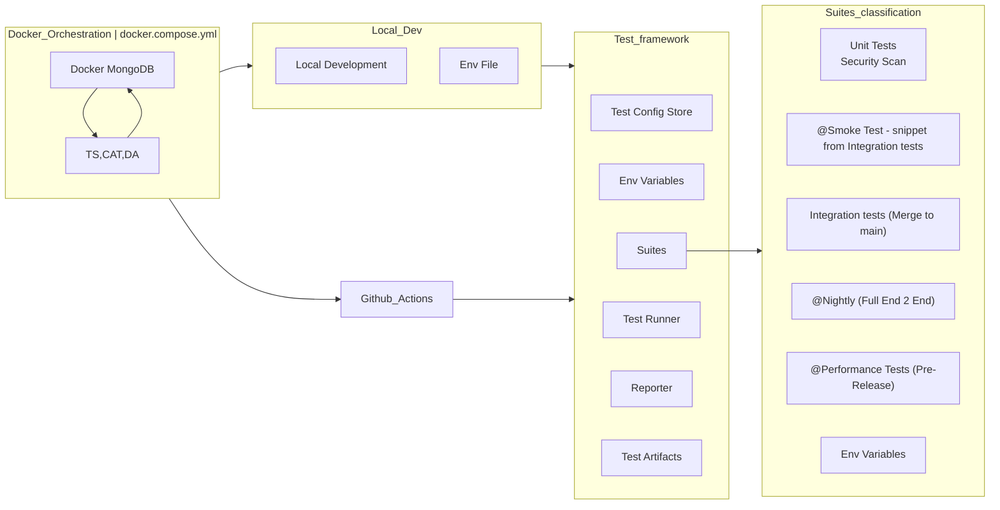

## Test Design

Concept of Testing Architecture for Catalog, TS, DA

Pre requisities:

- Testing will be insantiated within docker environments

Database for tests will be as separate container image

Application among with the tests will be bundled within `docker-compose.yml`



### 1. Docker Orchestration 
Purpose: Docker orchestration is crucial for automating the deployment, management, and scaling of application and test environments using Docker containers. The application will be built and bundled as a docker on both of the build environment to avoid any discrepancies of the environment. They will be passed the required config. This will allow independently to have architecture separated off the tests.  

Key Components: 

Docker Compose: Utilized for defining and orchestrating multi-container Docker applications through a YAML file (docker-compose.yml). The configuration including volumes (artefacts ) will be exposed. They will reside on the same network. Docker compose can be placed multiple times and built - driven with the shell script instructions for a better start up / shut down. This will serve with shell script to orchestrate spun up of the Docker.
`${DOCKER_TAG}:` - docker tag will be determined with the corresponding 
version of the app and build number. will be passed if needed as artifact 
within the flow
```yaml
services:
  catalog_service:
    image: catalog_service:${DOCKER_TAG}
    container_name: catalogservice_test_image_${DOCKER_TAG}
    healthcheck:
      test: ["CMD", "curl", "-f", "http://localhost"]
      interval: 1m30s
      timeout: 10s
      retries: 3
      start_period: 40s
      start_interval: 5s
    ports:
      - target: 3000
        published: ${CS_SERVICE_PORT}
    depends_on:
      - mongo_db
        - condition: service_healthy
    environment:
      - CS_SERVICE_PORT=3000
      - CS_SERVICE_HOST=0.0.0.0
      - CS_DATABASE_CONNECTION_STRING=${MONGO_DB_STRING}
      - LOGGER_LOG_LEVEL=DEBUG
  mongo_db:
    image: mongo:4.0.27-xenial
    container_name: catalog_service_test_${DOCKER_TAG}
    ports:
      - target: 27017
    volumes:
      - mongo_db:/data/db
```
The files composition dependent on the environment (if required):
`docker-compose.qa.yml` - variables and setup related to local development 
or QA environment
`docker-compose.dev.yml` - variables and setup related to cloud environment

Running of the docker compose: 

docker compose command will be inserted into shell script, where 
instrumentation logic will be inserted.

### Scripts invocation & portions: 
`start_docker.sh (up | restart | down) -environment (qa <> dev)` 
`docker compose up docker-compose.${ENVIRONMENT}.yml`

### Test Configuration Store

Purpose: Acts as a central repository for all configuration settings necessary for running tests. This centralized approach prevents configuration drift and promotes consistency across all testing environments.

Key Components:

Configuration Files: YAML, JSON, or JS/TS or environment-specific property files that store necessary configurations. These are the test related configurations not the environment specific.

Secrets Management Tools:  Secrets Manager tool, or Kubernetes Secrets to manage sensitive information such as database credentials or API keys securely

### Environment variables:

**Purpose**: Provides a flexible way to inject environment-specific settings 
into the application and test environment without hardcoding them into the codebase. This facilitates easy adjustments for different environments without code changes.

**Key Components:**

.env Files or CI/CD Variables: Utilization of .env files for local setups and environment variables defined in CI/CD pipelines (like GitHub Actions) for passing runtime configurations to the application and tests. For local development they will be part of script utils to set this up when composing docker local build.

**Secrets:**
- stored in Pipeline for pipeline environment
- stored in env.local for local development
- 
**Service variables**
- such as ports, urls stored  env file.

**Test variables:**
- such as TEST_TYPE or related to test, stored in codebase / config
  Purpose: Automates the execution of test suites, handling complexities such as test dependencies, order of execution, and parallelization to optimize the testing process. The test runner has to utilise abilities of the framework, so the invoked script to execute them will be translated from CI CD system as well as local development equally.

### Test Runner

Key Components:

Parallel Execution Engine: Capabilities to run tests in parallel, reducing the time required for test suites to complete. Integration with GitHub Actions to leverage matrix builds for testing across multiple

Purpose: Automates the execution of test suites, handling complexities such as test dependencies, order of execution, and parallelization to optimize the testing process. The test runner has to utilise abilities of the framework, so the invoked script to execute them will be translated from CI CD system as well as local development equally.

### Suites:

**Purpose:** Organizes tests into manageable, logical groups that can be 
executed conditionally based on the context of the code changes or the environment. This organization helps in efficient and effective testing strategies. The suites will be rather divided into segments / areas but for the runtime selection, the framework has to allow groping such a tests no matter folder structure.

The runner will execute the tests according to required flag.

**Key Components:**

**Test Suite Configuration:** Defined in configuration files or annotations 
within the code that categorize tests into suites like PR, Smoke, Regression, and Nightly, enabling targeted test executions. 

### Classification:
**Functional**
- unit tests
- service (feature) tests
- integration tests
**Non Functional**
- performance tests
- security tests

### Test division: 
from smaller portions to bigger regressions to have FFFF - fail fast, fix 
fast approach

| Test Type                       | Execution time        |
|---------------------------------|-----------------------|
| Unit test                       | Always                |
| PR test - basic verification    | Branch commit         |
| Security scan (SAST)            | Branch commit         |
| Smoke test                      | Pull request creation |
| Feature Service test            | Merge to main         |
| Integration test                | Merge to main         |
| Nightly - full suite regression | Over Night            |
| Performance                     | Weekly                |

### Reporter

Purpose: Aggregates test results and formats them into actionable insights, notifying developers of test outcomes and enabling quick reaction to failures. Customer reporter to be written or used format that will be understandable to collector. STDOUT is fine for the local development.
Key Components:
On Local Development this might generate artifacts such as HTML report / JSON file and have STDOUT output.  

### Test Artifacts

Purpose: Stores outputs from tests that are critical for further analysis, debugging, or auditing purposes, providing a traceable record of test executions. Beneficial would be logs from the application.

Key Components:

Artifacts Storage: Dedicated storage solutions, potentially leveraging cloud storage or integrated CI/CD artifact repositories, to store logs, and additional test output data. 

### GitHub Actions

Key Components:

Workflow Configuration Files: YAML files within the GitHub repository that define the triggers, jobs, steps, and conditions under which CI/CD operations should be performed. Github action will utilise the capabilities of the framework as well as instructions from the shell script.

Matrix: Run tests in parallel , Using a matrix for your jobs - GitHub Docs

Artifacts Store: Storing workflow data as artifacts - GitHub Docs

Docker orchestration: Dockerfile support for GitHub Actions - GitHub Docs 
